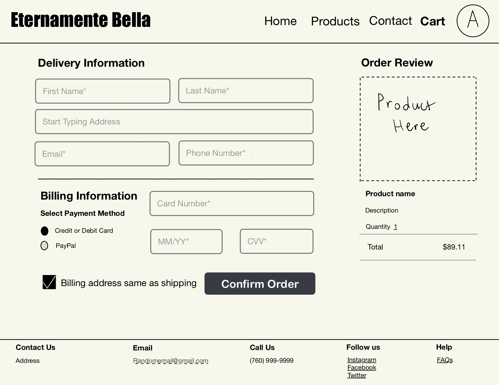

# Beauty By EB

### Elevator Pitch
**At Beauty by EB, our mission is to provide the finest _all-natural_ beauty products that help our loyal clients not only look their best but feel _more confident_ every day. Whether you're seeking _thicker_, _fuller_ hair or a _radiant complexion_, we offer premium products at a fraction of the cost. Why pay more when you can have the best? Choose Beauty by EB and be _Eternamente Bella—beautiful, always._**

### Design

### Key Features
- Tracking past purchases
- Secure login through https
- Real time data of stock per product
- Real time data of how many people have the same product in their cart
- Save information of what products are in each account holder's cart

### Technologies
1. HTML will be used to create multiple pages that will include the home page, a products page, a cart page, and a billing and address page. Also to provide links to different websites or spots on the same page.
2. CSS will be used to be able to color coordinate the page with the company's classic black and white look with supporitng colors to make the contrast pop. Along with ensuring there is good symmetry at all times.
3. Javascript will be used to allow users to scroll, and interact with different buttons on the website.
4. React will be used to create things like search bars to make it more accessible for users to interact with the webpage.
5. Backend service for retrieving information about previously purchased items for each individual with an account.
6. Authentication will be set up by having users sign up with an email and password to create their own accounts.
7. Databases will be used to not only store those accounts, but also to keep track of what a user might leave in their cart or past purchases they have made.
8. Websocket data will be the real-time stock of each item as people are choosing to buy it or how many people have the same item in their cart.
