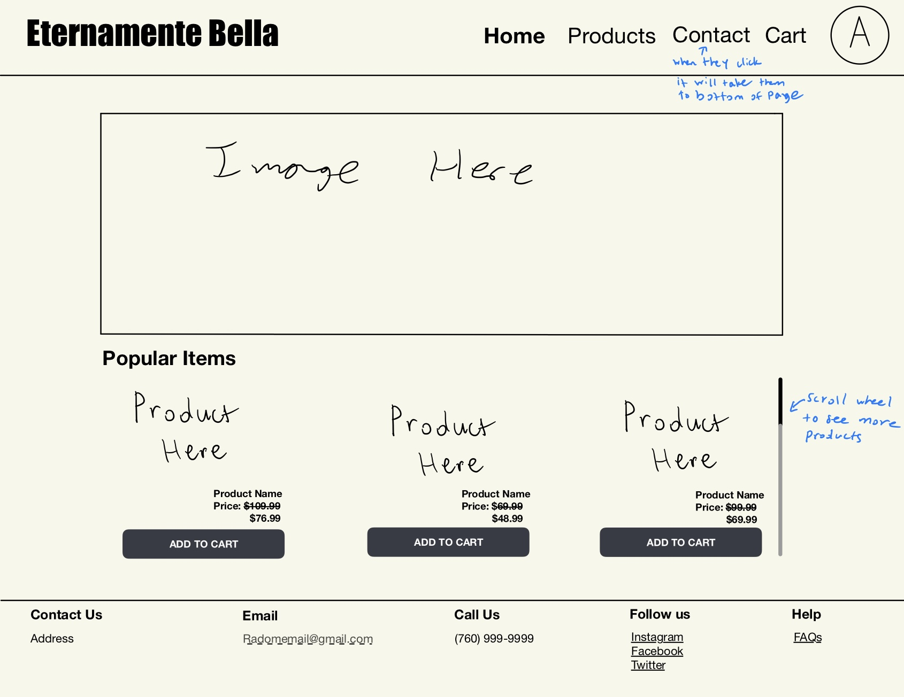

# Beauty By EB

### Elevator Pitch
**At Beauty by EB, our mission is to provide the finest _all-natural_ beauty products that help our loyal clients not only look their best but feel _more confident_ every day. Whether you're seeking _thicker_, _fuller_ hair or a _radiant complexion_, we offer premium products at a fraction of the cost. Why pay more when you can have the best? Choose Beauty by EB and be _Eternamente Bella—beautiful, always._**

### Design

### Key Features
- Tracking past purchases
- Secure login through https
- Real time data of stock per product
- Real time data of how many people have the same product in their cart
- Save information of what products are in each account holder's cart

### Technologies
1. HTML will be used to create multiple pages that will include the home page, a products page, a cart page, and a billing and address page. Also to provide links to different websites or spots on the same page.
2. CSS will be used to be able to color coordinate the page with the company's classic black and white look with supporitng colors to make the contrast pop. Along with ensuring there is good symmetry at all times.
3. Javascript/React will be used to allow users to scroll, and interact with different buttons on the website.
4. Backend service for retrieving information about previously purchased items for each individual with an account.
5. Authentication will be set up by having users sign up with an email and password to create their own accounts.
6. Databases will be used to not only store those accounts, but also to keep track of what a user might leave in their cart or past purchases they have made.
7. Websocket data will be the real-time stock of each item as people are choosing to buy it or how many people have the same item in their cart.

### HTML Deliverable

- [x] HTML Pages: I have a index, login, products, cart, and billing page
- [x] Properly use HTML tags: I used each tag at least once, along with other ones
- [x] Links between pages as necessary: Each page has links as neccesary to get from page to page
- [x] Website has textual content: "Our mission" text to show the user at the home page
- [x] Placeholder for 3rd party service calls: Home page will be inspirational quotes generated by a third party website.
- [x] Application images: I have an image of one of the products when in the cart
- [x] Login placeholder with username display: I have a login page where you can put in your information
- [x] Database data placeholder: Keep track of login information, and cart items/previous purchases
- [x] WebSocket data placeholder: Gives live updates of stock of items in cart, number of people with same products in their cart, and number of purchases of those items every minute they stay in the cart.

### CSS Deliverable

- [ ] Header, footer, and main content body
- [ ] Navigation elements
- [ ] Responsive to window resizing
- [ ] Application elements
- [ ] Application text content
- [ ] Application images
